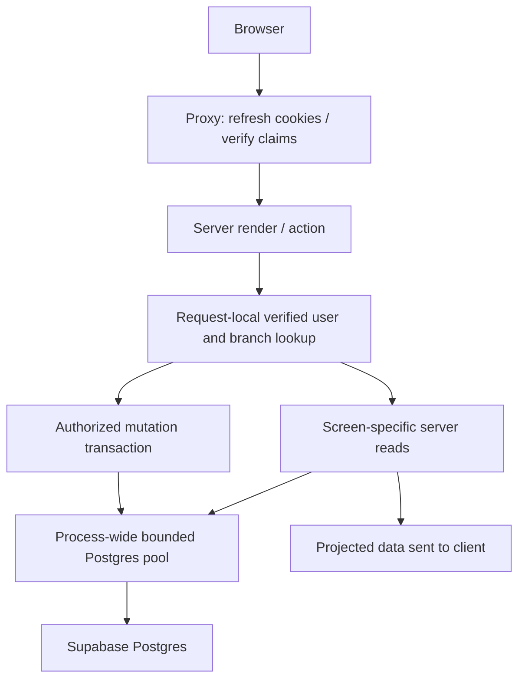

# Backend performance work — 2026-09-12

The hot paths now load only the data their screens use, reuse authorization
within one render, and batch writes. Live operational state is not cached across
requests. Database latency and end-to-end browser performance remain unmeasured:
the database profiler was blocked by `EACCES` in this environment.

## Data flow



`features/service/reads.ts` owns Service and Fair Queue projections;
`features/service/repository.ts` retains mutations and ticket/kitchen reads.
`bill-summary.ts` folds joined order lines into the existing bill/detail shape.

## Concrete reductions

Counts below are data SELECT statements, excluding authorization, BEGIN/COMMIT
and driver connection setup. They are derived from code, not a network trace.

| Path | Before | After |
| --- | --- | --- |
| Service | Up to 6 SELECTs, including unused floor canvases | 3 SELECTs; bill lines fetched once |
| Fair Queue | Full Service payload, including bills and canvases | 3 SELECTs: room names, live tables, active queue |
| Guest queue ticket | Ticket lookup, then count ahead | 1 statement with a correlated count |
| Layout + page authorization | Can fetch every accessible branch twice when permission arguments differ | One targeted branch lookup per render, shared across permissions |
| Cart persistence | One upsert per dish | One multi-row upsert for the validated cart, at most 50 dishes |
| Menu copy | One insert per source dish | One insert per 500 dishes, preserving name-conflict behavior |
| Floor publish | Updates every retained table | Skips unchanged table settings; keeps revision and row locks |

Guest menu and order reads were already parallel and remain so. Reads inside
one repeatable-read transaction use one connection; wrapping them in Promise.all
would not provide independent database connections or remove their round trips.

## Authentication, connection and freshness rules

- Branch lookup memoization is React request-local, keyed by branch ID separately
  from the permission check. The branch picker still loads all authorized branches.
- Proxy uses `getClaims` for refresh/signature verification. The data-access layer
  retains `getUser` for current user state and checks database membership. Cached
  JWKS can avoid a proxy Auth lookup for asymmetric signing keys; symmetric-key
  projects may still need a network lookup. No permissions come from client input.
- A process-wide Postgres pool survives development module reloads. It has at most
  five connections per process, a 20-second idle timeout, 10-second connection
  timeout and 30-minute maximum lifetime. Total deployment connections still
  multiply by the number of processes/instances. Restart after changing DB config.
- `prepare: false` is retained for transaction-pooler compatibility. Use the actual
  Supabase connection string appropriate for the deployment; no URL was changed.
- Service and Fair Queue retain consistent repeatable-read snapshots. Seating still
  locks and rechecks live state and authorization in its transaction.
- Kitchen, call display and guest ticket polling pauses while hidden/offline and
  avoids overlapping polling transitions. It refreshes on visibility/network
  return. Final guest tickets stop polling; kitchen writes pause its polling.
- Service and Fair Queue memoize the seating plan so typing into a form does not
  rerun matching. New snapshots and the waiting-time clock still invalidate it.
- Branch and guest-menu loading boundaries provide immediate navigation feedback;
  they do not make the underlying SQL faster.

These choices follow [Next.js request memoization guidance](https://nextjs.org/docs/app/getting-started/fetching-data),
[Supabase SSR authentication guidance](https://supabase.com/docs/guides/auth/server-side/creating-a-client?queryGroups=framework&framework=nextjs)
and [Supabase connection guidance](https://supabase.com/docs/guides/database/connecting-to-postgres).

## Index migration

`drizzle/0005_smart_dracula.sql` adds six indexes for membership lookup, organization
branches, sorted menu reads, branch order status, table order status and queue
status/wait order. Existing tenant constraints and RLS are unchanged.

The migration is generated and reviewed, **not applied by this work**. It uses
ordinary CREATE INDEX within the standard migration workflow; large live tables
need a suitable maintenance window because index construction can block writes.
Indexes add storage/write cost, and actual plan selection requires real data.

```sh
npm run db:migrate
npm run db:profile -- 9d8df7a0-0133-4138-850c-c737ce690087
```

The profiler performs five read-only EXPLAIN ANALYZE samples per representative
query. It prints round-trip time, execution time, row counts and plan/index names,
not customer rows or credentials. It enforces a 10-second statement timeout.
For comparison, run before and after applying indexes against the same data and
deployment region. It is not a full route load test and does not apply migrations.

## Local verification

- `npm test`: 79 tests passed, including bill aggregation and maximum matching.
- Production build and its TypeScript check passed.
- One-off comparison to the previous committed matcher: exact assignments, order
  and explanation strings matched in 1,000 seeded scenarios.
- Matching still prioritizes earlier candidates, but sorts eligible tables once
  and stops augmenting after every available table is assigned.

`npm run bench:performance` runs 10 warmups and 100 timed samples. On this machine,
100 tables / 500 parties took approximately **44.0 ms p50 / 61.6 ms p95 before**
the matcher change and **2.77 ms p50 / 3.20 ms p95 after**. These are synthetic
local CPU measurements from one run per version, not a site-wide speedup claim.
The 500-bill / 5,000-line projection measured 0.08 ms p50 / 0.17 ms p95 afterward.

## Remaining limits

Live database plans, migrations, concurrent writes and browser polling behavior
have not been integration-tested here because database access was blocked. Run
staging checks for add/call/seat/no-show, cashier permissions, multi-dish ordering,
menu copying and floor publishing before rollout.

The existing order model uses `served` for both kitchen completion and bill
closure. Service and guest reads still include those rows, preserving current
behavior, so historical rows can grow without bound. A separate visit/bill/payment
lifecycle is needed before safely excluding or paginating old bills; this refactor
does not silently discard them. Table combinations, real-time subscriptions and
cross-request menu caches are also outside this change.
